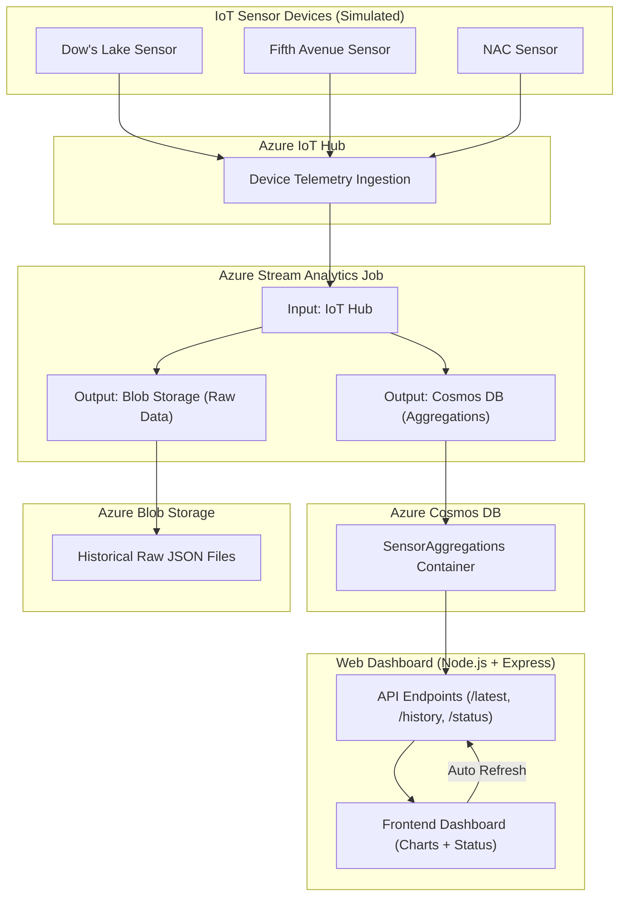

# Rideau Canal IoT Monitoring System  

##  Student Information
**Name:** Rohan Surti  
**Student ID:** 041164260

---

##  **Repositories**

- 🔹 **Sensor Simulation:** https://github.com/surt0008/CST8916_RideauCanal_Sensor_Simulation  
- 🔹 **Web Dashboard:** https://github.com/surt0008/CST8916_RideauCanal_Dashboard  

---
## **Video Demonstration Link**

👉 **Insert your video link h**

## **1. Project Description**

The Rideau Canal Ice Monitoring System is a complete end‑to‑end IoT solution that simulates ice‑condition sensors across different canal locations, sends data to Azure IoT Hub, processes it through Azure Stream Analytics, stores aggregated results in Cosmos DB, archives raw data into Blob Storage, and displays live insights on a fully interactive web dashboard.

This system helps determine whether sections of the canal are Safe, Caution, or Unsafe for skating, based on real‑time environmental readings.

## **2. Scenario Overview**

This project focuses on the real-world challenge of assessing safe skating conditions on the Rideau Canal. Because ice thickness and temperature change frequently, the National Capital Commission (NCC) requires continuous and accurate monitoring.  

To model this, the system simulates three monitoring stations located at:
- **Dow’s Lake**
- **Fifth Avenue**
- **National Arts Centre (NAC)**  

Each station generates sensor data every few seconds to replicate real environmental readings.

The goal of this system is to process, analyze, and visualize the incoming data in real time to automatically evaluate safety conditions. Using Azure IoT Hub, Stream Analytics, Cosmos DB, and Blob Storage, the solution forms a complete cloud-based IoT pipeline capable of handling continuous telemetry and providing insights instantly.

## **3. System Architecture**

The following diagram illustrates the end-to-end flow of the Rideau Canal IoT Monitoring System  from sensor simulation to analytics, storage, and dashboard visualization.


## **4. Azure Services Used**

| **Service**              | **Purpose**                                   |
|--------------------------|-----------------------------------------------|
| **IoT Hub**              | Device connection & telemetry ingestion       |
| **Stream Analytics**     | Real-time data processing & aggregation       |
| **Cosmos DB (NoSQL)**    | Stores calculated insights                    |
| **Blob Storage**         | Stores raw sensor data files                  |
| **App Service**          | Hosts the live web dashboard                  |
| **Azure CLI / Portal**   | Used for configuration & deployment           |

## **5. Data Flow Explanation**

### 1. Python Sensor Simulator
- Generates random but realistic environmental values.  
- Sends telemetry every **10 seconds**.  
- Pushes data as JSON to **Azure IoT Hub** using the Azure IoT SDK.  

---

### 2. Azure IoT Hub
- Acts as the central ingestion point for all three sensors (Dow’s Lake, Fifth Ave, NAC).  
- Forwards incoming telemetry to the **Stream Analytics** job for processing.  

---

### 3. Azure Stream Analytics
- Processes and analyzes all incoming sensor data in real time.  
- Runs a query that computes **1-minute aggregated results**.  
- Sends outputs to:  
  - **Cosmos DB** → aggregated/summarized data  
  - **Blob Storage** → raw unmodified telemetry for logging and auditing  

---

### 4. Cosmos DB
- Stores the latest and historical **aggregated ice condition data**.  
- Serves as the main data source for the **web dashboard’s API**.  

---

### 5. Blob Storage
- Stores raw JSON telemetry exactly as sent by the sensors.  
- Useful for audits, debugging, or long-term analytics.  

---

### 6. Web Dashboard
- Displays real-time sensor and safety information.  
- Visualizes data using charts and status indicators.  
- Automatically refreshes every **5 seconds** to show updated readings.  

## **6. Implementation Overview**

### 6.1 IoT Sensor Simulation  

**Features:**  
- Python-based simulator with 3 virtual devices  
- Sends structured JSON telemetry  
- Uses Azure IoT Device SDK (`azure-iot-device`)  
- Generates safety-related environmental values  

**Example JSON:**  
```json
{
  "location": "Dows Lake",
  "timestamp": "2025-12-11T10:00:00Z",
  "iceThicknessCm": 25.6,
  "surfaceTempC": -12.4,
  "snowAccumulationCm": 3.1,
  "externalTempC": -18.2
}
```
### 6.2 Azure IoT Hub  
Configured with:

- 3 registered devices
- Shared access keys
- Message routing to Stream Analytics

### 6.3 Stream Analytics Job

- Inputs: IoT Hub
- Outputs: Cosmos DB + Blob Storage

Query Used:
```bash
-- Send raw data to Blob
SELECT
    *
INTO
    [historical-data]
FROM
    [iot-rideau-canal-surt0008]
TIMESTAMP BY timestamp;


-- Send aggregated data to Cosmos 
SELECT
    CONCAT(location, '-', CAST(System.Timestamp AS NVARCHAR(MAX))) AS id,
    location,
    AVG(iceThicknessCm)       AS avgIceThicknessCm,
    AVG(surfaceTempC)         AS avgSurfaceTempC,
    AVG(snowAccumulationCm)   AS avgSnowAccumulationCm,
    AVG(externalTempC)        AS avgExternalTempC,
    System.Timestamp          AS windowEnd
INTO
    [SensorAggregations]
FROM
    [iot-rideau-canal-surt0008]
TIMESTAMP BY timestamp
GROUP BY
    location,
    TumblingWindow(minute, 1);
```

### 6.4 Cosmos DB Setup

- **Database:** `RideauCanalDB`  
- **Container:** `SensorAggregations`  
- **Partition Key:** `/location`  

**Stores:**  
- Aggregated readings  
- Safety status (computed by the dashboard API)

---

### 6.5 Blob Storage

- Container 
- Stores archived JSON telemetry files generated every minute 

Example file path:
``` 
2025/12/11/10/telemetry_10_00.json
```
### 6.6 Web Dashboard

**Built With:**  
- Node.js + Express  
- Chart.js  
- Fetch API  
- Auto-refresh logic (every few seconds)

**API Endpoints**

| Endpoint | Purpose |
|---------|---------|
| `/api/latest` | Returns latest reading per location |
| `/api/history/{location}` | Provides historical chart data |
| `/api/status` | Returns overall system safety status |
| `/api/all` | Debug end
---

### 6.7 Azure App Service Deployment

- **Node Version:** `18`  
- **Environment Variables:**  
  - `COSMOS_ENDPOINT`  
  - `COSMOS_KEY`  
  - `COSMOS_DATABASE`  
  - `COSMOS_CONTAINER`  

- **Deployment:**  
  Connected to GitHub CI/CD for automatic deployments.


## **7.Setup Instructions**

### Prerequisites
- Azure for Students subscription  
- Python 3.10+  
- Node.js 18+  
- Git  
- Visual Studio Code  

---

## High-Level Setup Steps

### 1. Clone All Repositories
```bash
git clone https://github.com/surt0008/CST8916_RideauCanal_Sensor_Simulation
git clone https://github.com/surt0008/CST8916_RideauCanal_Dashboard
```
### 2. Configure Azure IoT Hub

- Create a new **IoT Hub**
- Add **3 devices**:
  - DowsLake  
  - FifthAvenue  
  - NAC
- Copy each device’s **connection string**
- Paste the values into the `.env` file of your Python simulator

### 3. Run the Sensor Simulator
```bash
python simulator.py
```
### 4. Configure Stream Analytics

- Add **IoT Hub** as the input  
- Add **Cosmos DB** and **Blob Storage** as outputs  
- Paste the provided **SQL query** into the Stream Analytics job  
- Start the Stream Analytics job to begin real-time processing

### 5. Run the Web Dashboard Locally
```bash
npm install
npm start
```
## **8.Results & Analysis**

### Dashboard Output

- Real-time values update every **5 seconds**
- Historical charts display the **last 60 minutes** of readings
- Overall **safety status** is dynamically calculated
- Cosmos DB shows properly aggregated entries with correct `windowEnd` timestamps
- Blob Storage successfully stores all raw JSON logs

---

### Performance Observations

- Stream Analytics **processed incoming data with no delays**
- IoT Hub **received telemetry from all devices consistently**
- Dashboard queries Cosmos DB with **low latency**
- Auto-refresh feature in the dashboard **operates smoothly**

## **9. Challenges and Solutions**

| **Challenge** | **Solution** |
|---------------|--------------|
| Stream Analytics output not showing in Cosmos DB | Corrected output alias and validated field names |
| `crypto is not defined` in Node.js | Added WebCrypto polyfill |
| Dashboard stuck on “loading” | Fixed location normalization and sorting logic |
| Merge conflicts when pushing to GitHub | Pulled latest changes, merged, then pushed |
| IoT Hub not receiving messages | Updated incorrect device connection strings |
| Cosmos DB showing varbinary error | Removed unsupported fields and enforced consistent schema |

---

## **10.AI Tools Disclosure**

To comply with course policy:

### **AI tools used**
- ChatGPT (for debugging help, documentation wording, and diagram structure)

### **AI-generated content**
- README structure   
- Some troubleshooting explanations  
- Narrative/description wording  

### **My own contributions** 
- App Service deployment  
- Data flow implementation  
- Repository setup  
- Full video demonstration  

## **11.Conclusion**

This project successfully integrates IoT simulation, Azure cloud services, real-time data streaming, and a dynamic web dashboard into a complete monitoring system. By combining Azure IoT Hub, Stream Analytics, Cosmos DB, Blob Storage, and Azure App Service, the solution delivers a full end-to-end pipeline capable of collecting sensor data, processing it, storing it, and visualizing it for real-time decision-making.

Throughout the development process, I gained practical experience with cloud-based architectures, debugging distributed components, and designing reliable data flows. Challenges such as database schema issues, crypto errors, and dashboard integration helped deepen my understanding of troubleshooting and cloud operations. Overall, this project demonstrates how a well-structured IoT pipeline can effectively support real-world use cases such as monitoring ice safety conditions on the Rideau Canal.
